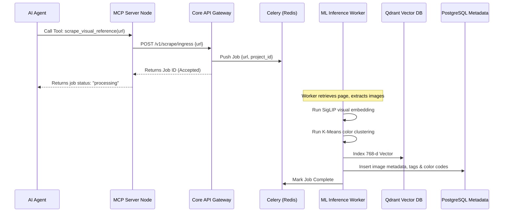
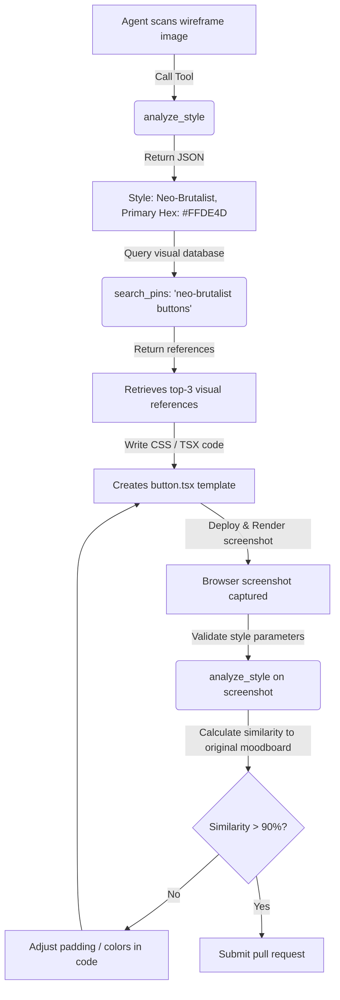

# Pinterest MCP Server: Architectural Specification

---
**Document Info:**
* **Module**: docs/architecture/README.md
* **Purpose**: System Topology, Data Flow, Sequence Diagrams, and Standard Specifications
* **Dependencies**: None
* **Author**: Lead Architect
* **Notes**: Architectural design is locked for the MVP phase.
---

## 1. High-Level System Architecture

The Pinterest MCP architecture uses a decoupled gateway topology. The Node.js MCP server handles incoming agent communication over Stdio/SSE, while heavy visual processing and vector operations are offloaded to a scalable FastAPI visual core API.

```
       ┌────────────────────────┐
       │  AI Agent / IDE Client │
       └───────────┬────────────┘
                   │
                   │ Standard MCP Protocol (Stdio / SSE)
                   ▼
       ┌────────────────────────┐
       │   Pinterest MCP Server │
       │  (Node.js / TypeScript)│
       └───────────┬────────────┘
                   │
                   │ gRPC / REST API Gateway
                   ▼
 ┌────────────────────────────────────────────────────────┐
 │                   FastAPI Core API Gateway             │
 ├─────────────────────────┬──────────────────────────────┤
 │   Authing & Filtering   │    Task Queue Manager        │
 └───────────┬─────────────┴──────────────┬───────────────┘
             │                            │
             │ Query / Metadata           │ Enqueue worker task
             ▼                            ▼
 ┌───────────────────────┐        ┌───────────────────────┐
 │ PostgreSQL / pgvector │        │  Redis / Celery Queue │
 └───────────────────────┘        └───────────┬───────────┘
                                              │
                                              ▼
                                  ┌───────────────────────┐
                                  │   Async Worker Pool   │
                                  │ (SigLIP, YOLO, OCR)   │
                                  └───────────┬───────────┘
                                              │
                                              ▼
                                  ┌───────────────────────┐
                                  │   Qdrant Vector DB    │
                                  └───────────────────────┘
```

---

## 2. Low-Level Component Design

### 2.1 MCP Gateway (Node.js/TypeScript)
* **Responsibility**: Manages client connections, parses agent session parameters, formats tool response packets, and enforces user/agent permissions.
* **Framework**: `@modelcontextprotocol/sdk` on Node 18+.

### 2.2 FastAPI Visual Core (Python)
* **Responsibility**: Houses ML model pipelines, coordinates image fetch/scraping instances, manages the vector search pipeline, and handles K-means clustering calculations.
* **Framework**: FastAPI + Uvicorn + PyTorch.

### 2.3 Vector Database (Qdrant)
* **Responsibility**: Multi-dimensional search indexes. Stores SigLIP embeddings ($768\text{-d}$) using Cosine distance indexes.

---

## 3. Core Data Flow & Sequence Diagrams

### 3.1 Scraping & Image Indexing Flow
When an agent submits an external design link for analysis, the sequence is managed asynchronously:



---

## 4. Agent Interaction Design (Visual RAG Pattern)

Autonomous coding agents (e.g., Cline, Claude Code) interact with the visual database during a frontend development workflow:



---

## 5. Technical Specifications & Standards

### 5.1 API Standards
* **Protocol**: HTTP/2 JSON REST & gRPC for internal service-to-service links.
* **Security**: SSL/TLS 1.3. Headers must include `X-MCP-Agent-ID` and `Authorization: Bearer <JWT>`.

### 5.2 Error Code Mapping

| Error Name | HTTP Status | Code ID | Reason |
| :--- | :--- | :--- | :--- |
| `INSUFFICIENT_PERMISSIONS` | 403 Forbidden | `MCP_4030` | Agent calling tool without target permissions. |
| `IMAGE_DOWNLOAD_FAILED` | 422 Unprocessable | `MCP_4220` | Provided image URL is broken or blocked. |
| `VECTOR_SEARCH_TIMEOUT` | 504 Gateway Timeout| `MCP_5041` | Cosine similarity query failed to return within SLA. |
| `INFERENCE_OVERLOAD` | 429 Too Many Requests| `MCP_4292` | ML workers queue is saturated. |

### 5.3 Logging & OpenTelemetry Instrumentation
Every request logs standard structured JSON tags:
```json
{
  "timestamp": "2026-06-09T10:22:21Z",
  "level": "INFO",
  "trace_id": "tr_091823901b23c4",
  "agent_id": "ag_cursor_cline_01",
  "tool_called": "search_pins",
  "duration_ms": 78,
  "status_code": 200
}
```

---

# ============================================
# FUTURE IMPROVEMENTS
# ============================================
#
# 1. Transition internal REST communication to high-efficiency gRPC channels
# 2. Add automatic profiling logs for CUDA memory utilization
# 3. Dynamic rate-limit scaling based on cluster node usage
#
# ============================================
